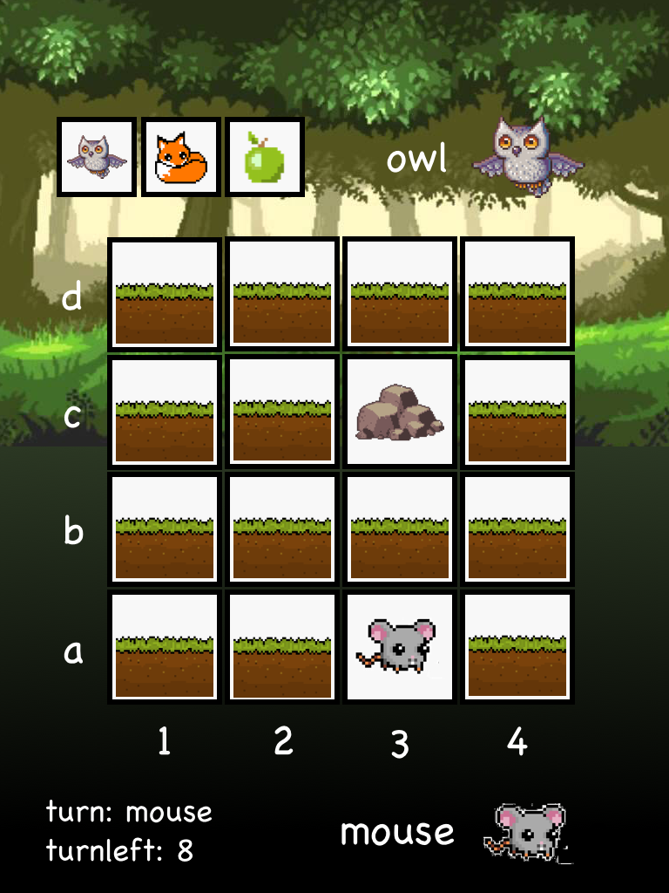

# Mouse vs Owl

## Figuur 1 - speelveld van Mouse vs Owl.

## Figuur 2 - class diagram version 1 of Mouse vs Owl.

## Beschrijving van de Game

### Beginpositie

In de game zie je een grid van 16 items. In 14 van deze items zit nu de GameItem 'grass'. In 1 item de GameItem Mouse en in een ander de GameItem Rock. Dit is het begin van de game.

### Doel

Als speler ben je de muis. Je moet de muis van de A-rij naar de D-rij proberen te krijgen. Wanneer je op de D-rij aangekomen bent heb je gewonnen.

De uil moet proberen  je tegen te houden door de muis van van het speelveld af te krijgen. Dit doet hij door de GameItemsa die hij in zijn inventory krijgt. Deze items worden steeds opnieuw gegenereert. Hij kiest het eerste item en speelt deze uit. Dat wel zeggen hij plaatst het op een willekeurige plaats op de D-rij

### Spel verloop

Het is een turn-based game. Als eerste is de speler aan de beurt. Deze verplaatst de muis. Vervolgens is de ai-speler aan de beurt. Hij kiest het eerste item uit zijn inventory en plaatst deze op het bord. Vervolgens bewegen de 'beweegbare' items op het bord.

Game items:

- Mouse: kan 1 stap naar rechts, links en boven.
- Rock: kan maar op 1 plek blijven. Maar niemand kan over dit GameItem heen.
- Grass: kan maar op 1 plek blijven. Over dit item kan wel iedereen heen lopen.
- Owl: zet 4 plaatsen naar beneden zetten. Wanneer hij over de mouse heen vliegt is de speler af.
- Fox: kan 1 plaats naar beneden zetten. Wanneer hij op de plek van de mouse komt dan is de speler af.
- Apple: kan 1 plaats naar beneden zetten. Is een snack voor de muis.