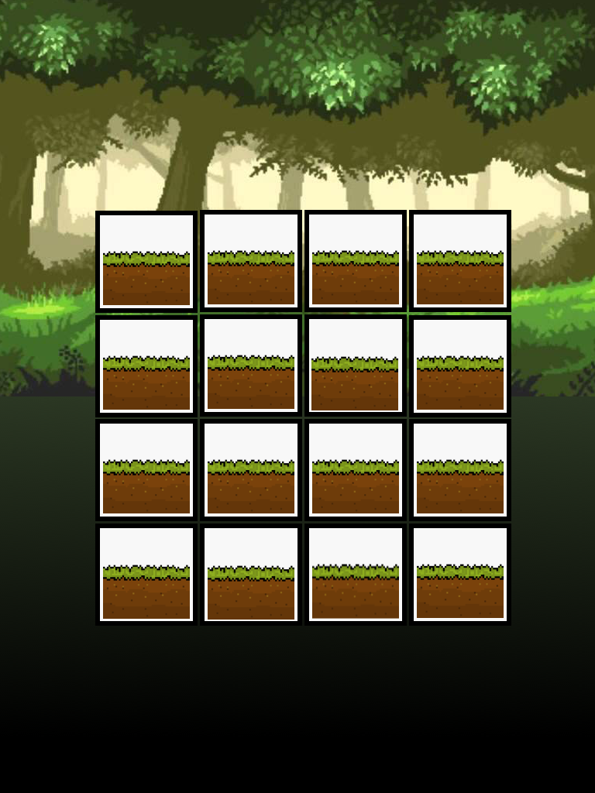
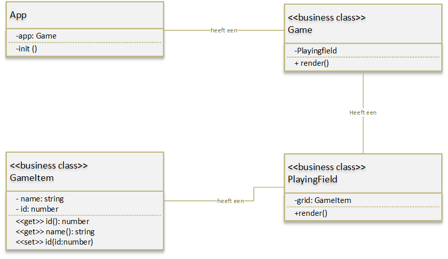

# Assignments Game development with TypeScript

## Week 1: dag 1 - install TypeScript(TS) and Types

In deze week staan de video's van de Lynda Course 'Typescript Essential Training' centraal.

### Introduction

Bekijk de videos uit ‘introduction’ en 'configuring your environment’. Installeer vervolgens TypeScript op je eigen omgeving. Vandaag starten we met `types`. We pakken dag 2 de ES6 functions op. Bij de uitwerking is het ten allen tijden verboden om jQuery te gebruiken!

### Opdracht 1.1

Bekijk de volgende video.

- 3.1 Introduction to JavaScript Types

Gegeven is het object `rocket` met de velden `xPos, yPos en image`. De methode van dit object is `render()`. Maak dit object in TS en gebruik daarvoor een object literal. Zorg er voor dat de functie render() het object ook daadwerkelijk in het DOM(door middel van `createElement() en appendChild()`) laat zien.

Hulp

- [Hoe werkt een object literal](https://developer.mozilla.org/nl/docs/Web/JavaScript/Reference/Operators/Object_initializer)

### Opdracht 1.2

Bekijk de volgende video’s:

- 3.2 Understanding type inference
- 3.3 Specifying JavaScript types

Breidt het object `Rocket` van opdracht 1 uit met de onderstaande twee functies. Maak gebruik van zoveel mogelijk types zoals getoond in de video’s.

- `move(xPosition, yPosition)`: wanneer je deze functie uitvoert wordt de nieuwe xPos en yPos van ‘rocket’ ingevuld. Tevens wordt de functie calculateDistance uitgevoerd.
- `calculateDistance(startPoint, endPoint)`: deze functie berekent de afstand tussen twee punten. Maak hierbij gebruik van de stelling van Pythagoras. Het vertrekpunt(startPoint) is de huidige xPos en yPos van de rocket en het eindpunt(endPoint) is de nieuwe (zie parameters van move) xPos en yPos van de ‘rocket’.

Hulp

- [Afstand tussen twee punten met Pythagoras](https://stackoverflow.com/questions/20916953/get-distance-between-two-points-in-canvas)

### Opdracht 1.3

Breidt opdracht 1.2 zo uit dat de `Rocket` gaat naar het punt waar je in de browser op klikt. Mocht dit makkelijk gaan. Probeer het eens met een animatie.

## Week 1: dag 2 - ES6 functions and custom types

### Opdracht 2.1

Bekijk de volgende video:

- 2.2 Default parameters.

Maak een functie createImgElement() die op basis van bepaalde parameters een een ImageElement maakt. Maak in de uitwerking ook gebruik van default parameters. Gebruik hiervoor `createElement` en `appendChild`. De volgende functie aanroep moet goed worden afgehandeld.

```javascript
createImgElement();
createImgElement('../assets/images/rocket.png', 'rocket'); //locatie van image en className van image.
```

Hulp:

- [Extra informatie over default parameters](https://www.sitepoint.com/es6-default-parameters/)
- [Informatie over createElement](https://developer.mozilla.org/nl/docs/Web/API/Document/createElement)

### Opdracht 2.2

Bekijk de volgende video:

- 2.3 Template strings

In opdracht 2.2 zijn er met behulp van `createElement()` en `appendChild` elementen aan de DOM toegevoegd, dit kun je echter ook doen met template strings. Pas opdracht 2.2 zo aan dat er gebruik wordt gemaakt van een template string.

Hulp:

- [Meer informatie over template strings](http://wesbos.com/template-strings-html/)

### Opdracht 2.3

Bekijk de volgende video:

- 2.4 Let en const

Voor het dagelijks gebruik kun je ‘const’ en ‘let’ goed inzetten. Echter je moet wel goed weten wat je doet. Maak een voorbeeld waarin het gebruik van ‘const’ en ‘let’ verkeerd gaat. Dit is best een tricky vraag want je moet goed weten wanneer je ‘const’ en ‘let’ in kan zetten. PS. Je mag niet het voorbeeld uit de video gebruiken. Voor studenten die dit eenvoudig vinden kunnen ook het probleem van ‘hoisting’ onderzoeken en toepassen in de opdracht.

Hulp:

- [Let vs const](http://wesbos.com/let-vs-const/)
- [Hoisting](https://medium.freecodecamp.org/what-is-variable-hoisting-differentiating-between-var-let-and-const-in-es6-f1a70bb43d)

### Opdracht 2.4

Bekijk de volgende video:

- 2.5 For … of loops

Gegeven is de array met objecten topGoalScoresWC.

```javascript

const topGoalScoresWC = [
    { firstName: 'Miroslav', lastname: 'Klose', team:'Germany', goals: 16, matches: 24, tournaments: [2002, 2006, 2010, 2014] },
    { firstName: 'Ronaldo', lastname: '', team: 'Brasil', goals: 15, matches: 19, tournaments: [1998, 2002, 2006] },
    { firstName: 'Gerd', lastname: 'Muller', team: 'Germany', goals: 16, matches: 24, tournaments: [2002, 2006, 2010, 2014] },
    { firstName: 'Just', lastname: 'Fontaine', team: 'France', goals: 14, matches: 13, tournaments: [1970, 1974] },
    { firstName: 'Pele', lastname: '', team: 'Brasil', goals: 12, matches: 14, tournaments: [1958, 1962, 1966, 1970] },
    { firstName: 'Sandor', lastname: 'Kocsis', team: 'Hungary', goals:11, matches: 5, tournaments: [1954] },
    { firstName: 'Jurgen', lastname: 'Klinsmann', team: 'Germany', goals: 11, matches: 17, tournaments: [1990, 1994, 1998] },
    { firstName: 'Helmut', lastname: 'Rahn', team: 'Germany', goals: 10, matches: 10, tournaments: [1954, 1958] },
    { firstName: 'Gary', lastname: 'Lineker', team: 'England', goals: 10, matches: 12, tournaments: [1986, 1990] },    
    { firstName: 'Gabriel', lastname: 'Batistuta', team: 'Argentina', goals: 10, matches: 12, tournaments: [1994, 1998, 2002] },    
];
```

1. Schrijf middels een `for ... of` loop alle namen naar de console.
2. Schrijf middels de `.map()` function de gecombineerde achternaam en voornaam naar de console.
3. Schrijf middels de `.filter()` function alleen de voornamen van de spelers die meer dan 11 doelpunten hebben gescoord naar de console.

Hulp

- [map(), filter()](http://cryto.net/~joepie91/blog/2015/05/04/functional-programming-in-javascript-map-filter-reduce/)

### Opdracht 2.5

Bekijk de volgende video:

- 2.6 Lambdas

Gegeven is de class Counter, deze code werkt niet naar behoren. Pas deze  aan (met een lambda) zodat er wel cijfers naar de console worden weggeschreven.

```javascript
class Counter{
    private _counter:number = 0;
    constructor(){
        document.getElementById('body').addEventListener('click', this.clickHandler);
    }
    public clickHandler (e:Event){
        this._counter++;
        console.log(this._counter);
    }
}
```

Hulp

- [arrow functions](https://developer.mozilla.org/en-US/docs/Web/JavaScript/Reference/Functions/Arrow_functions)
- [Wes Bos about arrow functions](http://wesbos.com/arrow-functions/)

### Opdracht 2.6

Bekijk de volgende video:

- 2.8 The spread operator

Gegeven is de array uit opdracht 4.

1. Maak een exacte copy van de array met behulp van de spread operator.
2. Voeg middels de spread operator twee nieuwe spelers objecten toe voor de speler ‘Gerd Muller’.

Hulp

- [some ways to use the spread operator](https://davidwalsh.name/spread-operator)

### Opdracht 2.7

Bekijk de volgende videos

- 4.1 Designing custom types with interfaces
- 4.2 Using interfaces to describe functions
- 4.3 Extending interface definitions
- 4.4 Defining constant values with enums
- 4.5 Defining anonymous types

Breidt de opdracht 2.1 als volgt uit:
Maak een generieke functie ‘createDomElement' waarmee je (bijna) alle DOM elementen kan maken (met behulp van `document.createElement()`). Dat wil zeggen de volgende functie aanroepen moeten goed worden uitgevoerd en afgehandeld.

De opdracht kan alleen uitgevoerd worden wanneer je een interface maakt voor het parameter object dat wordt meegegeven.

```javascript
const div = createDomElement({tagName: 'div', attributes: {class:'card'}});
const p = createDomElement({ tagName: 'p', attributes: { class: 'news', id: 'introduction' }, content: 'The news for today' });
const img = createDomElement({ tagName: 'img', attributes: { class: 'newDiv', id: 'profile_image', src: './assets/images/windsock.png' } });

```

### Opdracht 2.8

Verander de bovenstaande uitwerking de `document.createElement()` door het gebruik van template strings. Dit is een lastige opdracht!

## Week 1: Dag 4

Classes, class diagram en modules.

## Week 1: Dag 5

### Eindopdracht week 1 - Mouse vs Owl

Vandaag maken we een start met de turnbased game Mouse vs Owl. Als eerste gaan we het speelveld (playingfield) ontwikkelen. De game wordt zelf in zijn eigen documentatie verder uitgeschreven. in figuur 1 zie je een grafische weergave van het speelveld. In figuur 2 staat een class diagram van het speelveld.



figuur 1 - speelveld van Mouse vs Owl.



Figuur 2 - class diagram version 1 of Mouse vs Owl.

Maak dit speelveld zo getrouw mogelijk na in HTML, CSS en TypeScript.
Wanneer dit je nu gemakkelijk afgaat mag je ook 'Modules' gaan maken en toepassen in de door jou gemaakte code.
